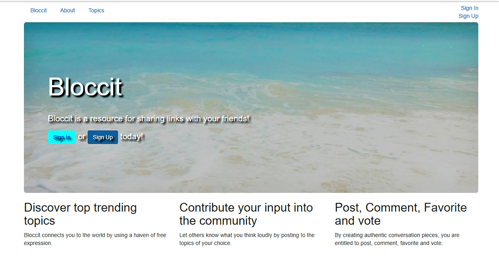
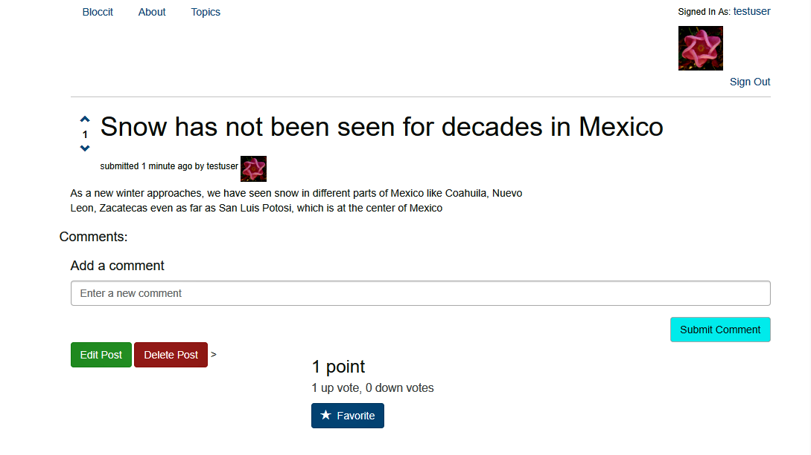
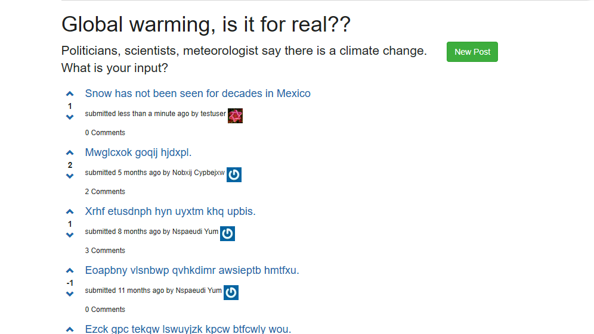

 ## Bloccit: a Reddit replica to teach the fundamentals of web development and Rails.
 
 
 
 ------------------------------------------------------------------------------
 
 Bloccit is an application in which users can log in and out, as well as having
 their Avatar image showing on their profile. A user can create posts, leave 
 comments, up-vote and down-vote on comments and posts. 
 
 
 
 
 
 Bloccit allows specific users to create new Topics, edit and delete Topics, Posts
 and comments.
 
 
 
 ------------------------------------------------------------------------------
 
 Made with my mentor at [Bloc](http://bloc.io).